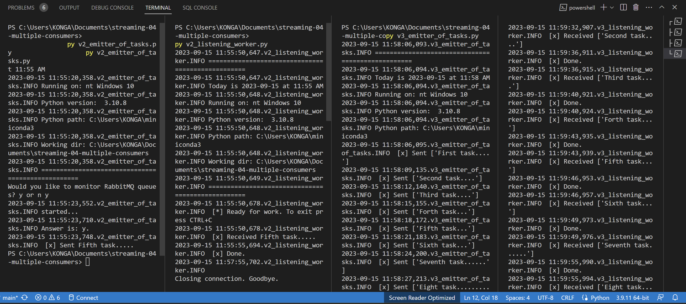

Priyanka Gorentla  

Modified date: 15th September 2023  

# streaming-04-multiple-consumers

> Use RabbitMQ to distribute tasks to multiple workers

One process will create task messages. Multiple worker processes will share the work. 

## Before You Begin

1. Fork this starter repo into your GitHub.
1. Clone your repo down to your machine.
1. View / Command Palette - then Python: Select Interpreter
1. Select your conda environment. 

## Read

1. Read the [RabbitMQ Tutorial - Work Queues](https://www.rabbitmq.com/tutorials/tutorial-two-python.html)
1. Read the code and comments in this repo.

## RabbitMQ Admin 

RabbitMQ comes with an admin panel. When you run the task emitter, reply y to open it. 

(Python makes it easy to open a web page - see the code to learn how.)

## Execute the Producer

1. Run emitter_of_tasks.py (say y to monitor RabbitMQ queues)

Explore the RabbitMQ website.

## Execute a Consumer / Worker

1. Run listening_worker.py

Will it terminate on its own? How do you know?  It won't terminate on its own. Process continues util we give "CTRL+C" command.

## Ready for Work

1. Use your emitter_of_tasks to produce more task messages.

## Start Another Listening Worker 

1. Use your listening_worker.py script to launch a second worker. 

Follow the tutorial. 
Add multiple tasks (e.g. First message, Second message, etc.)
How are tasks distributed? Worker A picks up "First message" and starts processing it.  
Worker B picks up "Second message" and starts processing it.  
Worker A completes "First message."  
Worker B completes "Second message."  
Worker A picks up "Third message" and starts processing it...and soon, process continues. 
Monitor the windows with at least two workers.  
Which worker gets which tasks? Can't say exactly.Its choosing randomly i guess.  

## Reference

- [RabbitMQ Tutorial - Work Queues](https://www.rabbitmq.com/tutorials/tutorial-two-python.html)

## Your Project - Version 3 - Automating the Tasks

In this part, you'll build a Version 3 much like Version 2, except - instead of getting messages from the console the producer will read from tasks.csv. Much easier for the human! Multiple workers will retrieve the messages as they do in version 2.  

1. Copied the Version 2 files(emitter and listener) to start version 3(v3_emitter_of_tasks and v3_listening_worker).   
2. Read the input file "tasks.csv" instead of the console. 
3. Should you hardcode the data filename? Or would it be helpful to assign the filename to a variable? it will be helpful to assign the filename to a variable.  
4. Added more records to tasks.csv file.  

## Screenshot

See a running example with at least 3 concurrent process windows here:

